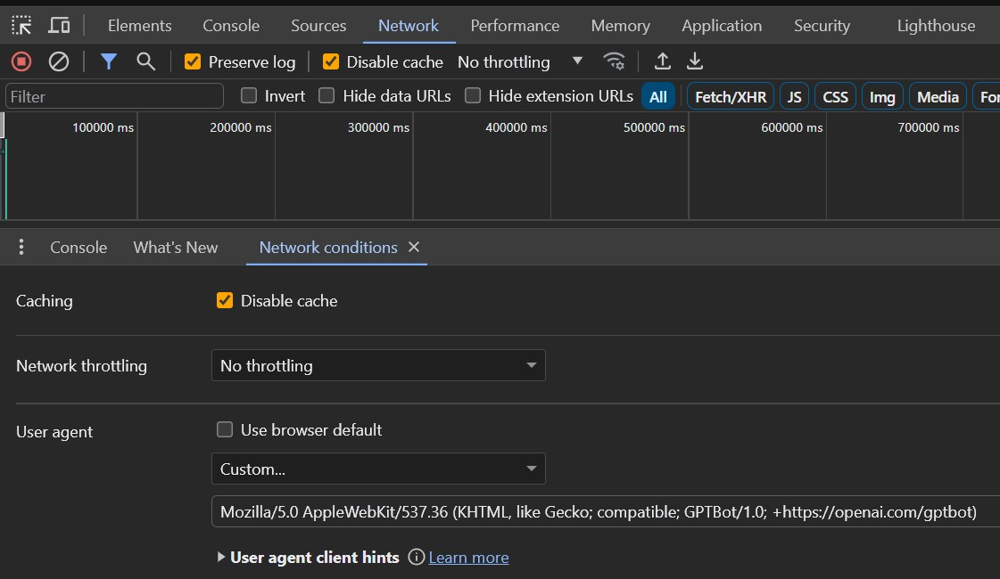

# OpenFeature & OpenTelemetry Dice Roller

The OpenTelemetry dice roll example instrumented with [OpenFeature](https://openfeature.dev), [Jaeger](https://jaegertracing.io) and [flagd](https://flagd.dev).

This is the [OpenTelemetry "getting started" code (in Go)](https://opentelemetry.io/docs/instrumentation/go/getting-started/), slightly modified to:

1) Send traces to Jaeger and not stdout
2) The dice roller application is feature flagged to add an artificial pause
3) The dice roller application adds the feature flag information to the span data according to the [OpenTelemetry specifications for feature flags](https://opentelemetry.io/docs/specs/semconv/feature-flags/feature-flags-spans/).


In this setup, both flagd (the flag backend system) **and** the "dice roller" application will both generate OpenTelemetry traces.

This provides two "lenses" on the data:

1) From the perspective of the flag backend system operator (ie. How healthy is my flag backend)
2) From the user's perspective (ie. What experience are my user's receiving when using the system

# Run in the Cloud

## Step 1: Open Codespace

1. Click "Code" and change to "Codespaces" tab.
2. Click "Open codespace on main"

Wait until you see "Running postStartCommand..."


## Step 2: Access Application

1. Navigate to the "Ports" tab
2. Hover over the "Dice Roller Application" and click the globe icon to open the URL in a browser

You should now see a single digit printed to the screen. If so, it worked.

## Step 3: Access Jaeger

1. Switch back to the "Ports" tab
2. Repeat the above process, this time for "Jaeger"

Jaeger should show 2 services:

- `dice-roller`
- `flagd`

## Step 4: View Application Traces

The `dice-roller` traces are generated from the application itself. They tell the story of your users experience with the application.

Notice the metadata available on each traces which denotes the feature flag name, value and backend provider.


## Step 5: View flagd Traces

These traces are generated from your flag system (flagd). They show the internal workings of the flag backend.

Every action that flagd takes is recorded as an OpenTelemetry trace.


## Step 6: Change flag definition

It is time to slow your roll. Do this by changing the feature flag definition (effectively, turning it on).

Modify [line 9 of demo.flagd.json](https://github.com/agardnerIT/openfeature-otel-dice-roller/blob/45b8496620cfed77c54a21f8526661c9e31b9cc6/demo.flagd.json#L9) and change `defaultValue` from `off` to `on`.

This will make flagd return the `on` variant with the value `true`.

> Note: No restarts are necessary. Flagd is watching this file so will automatically pick up the changes and emit an OpenTelemetry trace

In Jaeger under the `flagd` service, notice there is a `flagSync` trace with the relevant information including how many flags were updated.

This traces shows how long it took flagd to notice the change to `demo.flagd.json` and update the backend.


## Step 7: Create and View Slowed Requests

Refresh the application a few times to create some slow requests (should take 2s each).

Click "Find traces" again in Jaeger to view the slower traces. Examine the span metadata to see the feature flag information.

Notice that `feature_flag.variant` is now `true` and [the code stipulates that in this case]([url](https://github.com/agardnerIT/openfeature-otel-dice-roller/blob/72187d4bd5cc215dd842db4ed933d78eb165f502/rolldice.go#L58)), the request is slowed down.


## Step 8: Slow Down traces for everyone except ChatGPT Bot

As you've seen above, feature flags allow for different experiences / features per user cohort.

For example, providing Large Language Models (LLMs) with a page optimised for them whilst providing "normal" users the standard page.

The browsers `UserAgent` header will now be leveraged to provide a different user experience depending on the header value.

- Normal users will get a slow response (simulating returning "standard" content")
- The ChatGPT bot will receive a fast response (simulating returning LLM-optimised content)

To achieve this we need to:

- Send the UserAgent string to flagd so that the value can be evaluated when a flag value decision is being made
- Ensure this contextual data is available on the distributed traces so that the human system operators can understand **why** certain requests are slow
- Based on that evaluation, flagd will then return the appropriate `slow-your-roll` value. `on` for normal users (slow) and `off` for ChatGPT bot

### Send Evaluation Context

[The code is already configured](rolldice.go#L58) to send the `UserAgent` string to flagd.

### Contextual Data in Traces

[The evaluation contextual data is already being added](rolldice.go#L78) as a span attribute and will appear in Jaeger.

## Configure slow-your-roll flag

Open `demo.flagd.json` and replace the existing flag definition with the content below. Save the file.

This definition means:

1. Everyone gets the `defaultVariant` of `on` (ie. a slow response)
2. Unless the `targeting` rule is matched
3. If an evaluation context variable of `userAgent` (see [key in rolldice.go](rolldice.go#L60)) is available and it contains the string `GPTBot` then return `off` (ie. a fast response)
4. If an evaluation context variable of `userAgent` is available, but the value does **not** contain `GPTBot` then return `on` (ie. slow response)

```
{
  "flags": {
    "slow-your-roll": {
      "state": "ENABLED",
      "variants": {
        "on": true,
        "off": false
      },
      "defaultVariant": "on",
      "targeting": {
        "if" : [{
          "in": [ "GPTBot", { "var": "userAgent" } ]
        },
        "off", "on"
        ]
      }
    }
  }
}
```

### Test it out

Refresh the demo app page and the response will still be slow.

Change the browser UserAgent to [match ChatGPTs](https://platform.openai.com/docs/gptbot/gptbot):

```
Mozilla/5.0 AppleWebKit/537.36 (KHTML, like Gecko; compatible; GPTBot/1.0; +https://openai.com/gptbot)
```

In Chrome:

1. Open DevTools
2. Go to `Network` tab
3. Open the `Network Conditions` subtab
4. Uncheck the "use default" box
5. Enter the above UserAgent

Refresh the demo app again and with the new UserAgent, the experience will be quick.



---------------------

# Run Locally

## Step 1: Start Jaeger

Start [Jaeger](https://jaegertracing.io) so there is a trace backend available to send traces to:

```
docker run --rm --name jaeger \
  -p 4317:4317 \
  -p 4318:4318 \
  -p 16686:16686 \
  jaegertracing/all-in-one:1.50
```

## Step 2: Start flagd

Start flagd and have it send traces to Jaeger:

```
docker run \
  --rm -it \
  --name flagd \
  -p 8013:8013 \
  -v $(pwd):/etc/flagd \
  ghcr.io/open-feature/flagd:latest start \
  --uri file:./etc/flagd/demo.flagd.json \
  --metrics-exporter otel \
  --otel-collector-uri localhost:4317
```

or (if you have flagd in your `PATH`):
```
flagd start --port 8013 --uri file:./demo.flagd.json --metrics-exporter otel --otel-collector-uri localhost:4317
```

## Step 3: Run application

```
go mod tidy
go run .
```

Access the application: `http://localhost:8080/rolldice`

## Step 4: View Application Traces

These traces are generated from the application itself. They tell the story of your users experience with the application.

View traces in Jaeger: `http://localhost:16686/search?service=dice-roller`


## Step 5: View flagd Traces

These traces are generated from your flag system (flagd). They show the internal workings of the flag backend.

View traces in Jaeger: `http://localhost:16686/search?service=flagd`


## Step 6: Change flag definition

It is time to slow your roll. Do this by changing the feature flag definition (effectively, turning it on).

Modify [line 9 of demo.flagd.json](https://github.com/agardnerIT/openfeature-otel-dice-roller/blob/45b8496620cfed77c54a21f8526661c9e31b9cc6/demo.flagd.json#L9) and change `defaultValue` from `off` to `on`.

This will make flagd return the `on` variant with the value `true`.

> Note: No restarts are necessary. Flagd is watching this file so will automatically pick up the changes and emit an OpenTelemetry trace

In Jaeger under the `flagd` service, notice there is a `flagSync` trace with the relevant information including how many flags were updated.

This traces shows how long it took flagd to notice the change to `demo.flagd.json` and update the backend.


## Step 7: Create and View Slowed Requests

Refresh the application a few times to create some slow requests (should take 2s each): `http://localhost:8080/rolldice`.

Click "Find traces" again in Jaeger to view the slower traces. Examine the span metadata to see the feature flag information.

Notice that `feature_flag.variant` is now `true` and [the code stipulates that in this case]([url](https://github.com/agardnerIT/openfeature-otel-dice-roller/blob/72187d4bd5cc215dd842db4ed933d78eb165f502/rolldice.go#L58))


## Step 8: Slow Down traces for everyone except ChatGPT Bot

As you've seen above, feature flags allow for different experiences / features per user cohort.

For example, providing Large Language Models (LLMs) with a page optimised for them whilst providing "normal" users the standard page.

The browsers `UserAgent` header will now be leveraged to provide a different user experience depending on the header value.

- Normal users will get a slow response (simulating returning "standard" content")
- The ChatGPT bot will receive a fast response (simulating returning LLM-optimised content)

To achieve this we need to:

- Send the UserAgent string to flagd so that the value can be evaluated when a flag value decision is being made
- Ensure this contextual data is available on the distributed traces so that the human system operators can understand **why** certain requests are slow
- Based on that evaluation, flagd will then return the appropriate `slow-your-roll` value. `on` for normal users (slow) and `off` for ChatGPT bot

### Send Evaluation Context

[The code is already configured](rolldice.go#L58) to send the `UserAgent` string to flagd.

### Contextual Data in Traces

[The evaluation contextual data is already being added](rolldice.go#L78) as a span attribute and will appear in Jaeger.

## Configure slow-your-roll flag

Open `demo.flagd.json` and replace the existing flag definition with the content below. Save the file.

This definition means:

1. Everyone gets the `defaultVariant` of `on` (ie. a slow response)
2. Unless the `targeting` rule is matched
3. If an evaluation context variable of `userAgent` (see [key in rolldice.go](rolldice.go#L60)) is available and it contains the string `GPTBot` then return `off` (ie. a fast response)
4. If an evaluation context variable of `userAgent` is available, but the value does **not** contain `GPTBot` then return `on` (ie. slow response)

```
{
  "flags": {
    "slow-your-roll": {
      "state": "ENABLED",
      "variants": {
        "on": true,
        "off": false
      },
      "defaultVariant": "on",
      "targeting": {
        "if" : [{
          "in": [ "GPTBot", { "var": "userAgent" } ]
        },
        "off", "on"
        ]
      }
    }
  }
}
```

### Test it out

Refresh the demo app page and the response will still be slow.

Change the browser UserAgent to [match ChatGPTs](https://platform.openai.com/docs/gptbot/gptbot):

```
Mozilla/5.0 AppleWebKit/537.36 (KHTML, like Gecko; compatible; GPTBot/1.0; +https://openai.com/gptbot)
```

In Chrome:

1. Open DevTools
2. Go to `Network` tab
3. Open the `Network Conditions` subtab
4. Uncheck the "use default" box
5. Enter the above UserAgent

Refresh the demo app again and with the new UserAgent, the experience will be quick.


